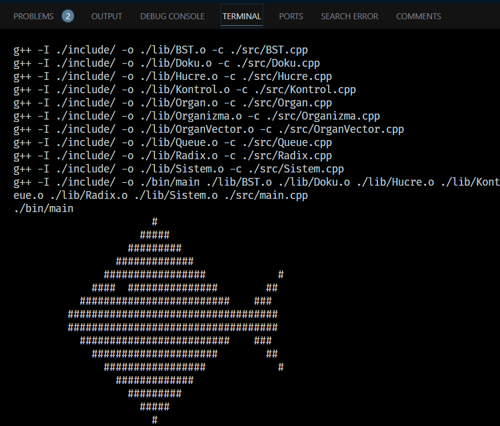

# Organism Simulation using Queue and Tree Data Structures

This project simulates an organism using C++ programming and implements queue and tree data structures. The organism is constructed from cells with DNA lengths read from a data file, which are then organized into tissues and represented as an organism consisting of systems. The DNA lengths of cells play a crucial role in shaping the organism's structure and behavior.

## Usage

Run the executable file generated after compilation.

The program will read data from the specified text file and simulate the organism based on the provided logic.

The resulting organism will be displayed, with balanced trees represented by whitespace and unbalanced trees represented by hashtags.

Press the enter key to trigger mutation in the organism if conditions are met.

### Folder Structure

```plaintext
Organism-Simulation/
├── include/                   # Header files (.hpp) for each class
├── lib/                       # Object files (.o) generated during compilation
├── src/                       # Source files (.cpp) for each class
├── doc/                       # Project docs
├── bin/                       # Executable file of the program
├── Veri.txt                   # Fish like organism structure data
├── Veri2.txt                  # Smile Emoji like organism structure data
├── LICENSE.md                 # License
└── README.md                  # Project README file

```
### Run using MinGW

To run this  program, you will need to have the MinGW development environment installed on your machine. Once you have you can simply run

```bash
mingw32-make
```
This command will execute the default target in the `makefile`, which is all rule based on the provided `makefile`. This rule compiles all source files and links them into an executable.

## Documentation

{: width="500"}
_Fish Organism_
{: width="500"}
_Smiley face Organism_

## Project Components

1. Cell Class
Represents individual cells with DNA lengths read from the data file. Each cell contributes to the formation of tissues.

2. Texture Class
Represents tissues formed by grouping cells. Each line in the data file corresponds to a texture.

3. Organ Class
Manages the tissues using a binary search tree. Tissues are sorted and organized based on the median DNA length.

4. System Class
Represents a collection of organs forming a system within the organism.

5. Organism Class
Manages multiple systems to construct the entire organism.

6. Control Class
Handles the main logic of reading data, organizing tissues, and constructing the organism.

7. Radix Sort
Sorting algorithm used to sort cells within textures.

8. Queue
Data structure used for processing cells read from the data file.

## Functionality

Data Reading and Processing: The program reads DNA lengths of cells from a text file, groups them into tissues, and sorts them using radix sort.

Tree Organization: Tissues are organized into binary search trees based on median DNA length. Balanced trees are represented as whitespace, while unbalanced trees are represented as hashtags.

> [!NOTE]
> Mutation process is not done yet

Mutation: If the DNA length of the middle cell at the root of a tree is divisible by 50, cells in the tissues mutate based on specified rules. Mutated trees are rebuilt and displayed as the updated organism.